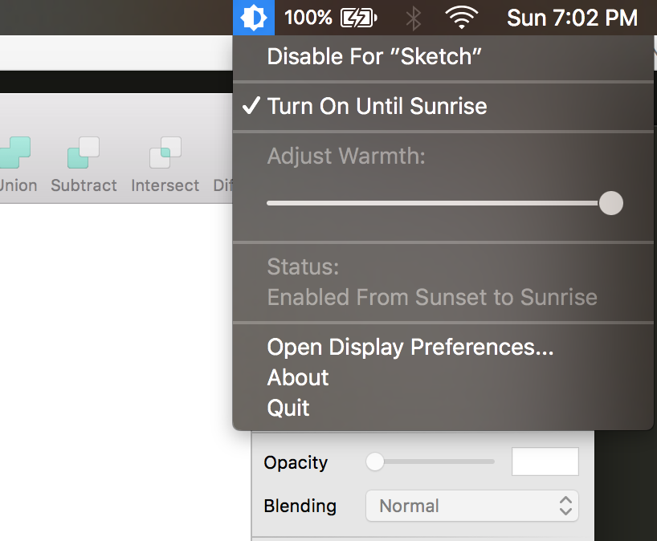

# Night Shift Control

## Introduction

Night Shift Control is a simple macOS menubar app for controlling Night Shift. It's aim is to bring features from f.lux which are missing from Night Shift such as disabling Night Shift for certain apps.

## Screenshot

## Features

* Disable Night Shift for apps of your choice
* Easily turn on/off Night Shift from the menubar
* Control Night Shift warmth from the menubar
* Shows the current Night Shift status and color temperature info (press ⌥ while clicking the menu bar item to see)

## Download

Download from [here](https://github.com/isaiasmatewos/night-shift-control/releases/download/v0.1/night_shift_control_v0.1.zip "here")

## How to install

This app is not officially singed so you will need to disable Gatekeeper temporarily to install it.
You can disable Gatekeeper using the following command:

`sudo spctl --master-disable`

Then unzip the zip file and simply drag to the Applications folder.

**N.B: It's' highly recommended that you enable Gatekeeper after you  run the above command, by going to System Preferences -> Security and Privacy -> General**

## Make it start at login

If you find Night Shift Control useful and want it launched every time you login. You can add it to login items by going to System Preferences -\> Users & Groups -\> Login Items -\> click the '+' button and find Night Shift Control.

## How to build

This app depends on a private framework located at `/System/Library/PrivateFrameworks/CoreBrightness.framework`. I was not able to successfully build this project by adding this framework from it's original path. What worked is copying `CoreBrightness.framework` to a folder I owned i.e under your the User directory, and adding that folder in Project Properties -> Build Settings -\> Framework Search Paths.
